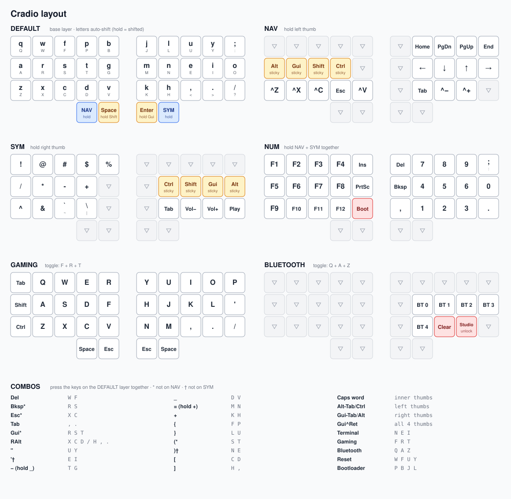

# ZMK config: Cradio

ZMK firmware config for a 34-key split keyboard (`nice_nano_v2`, shield `cradio`), built with Nix.



The diagram is generated by [docs/gen_layout_svg.py](docs/gen_layout_svg.py). If `config/cradio.keymap` changes, have an LLM update the data in that script and regenerate the SVG.

## Build

```bash
nix build          # firmware for both halves in ./result
nix run .#flash    # flash the built firmware
```
